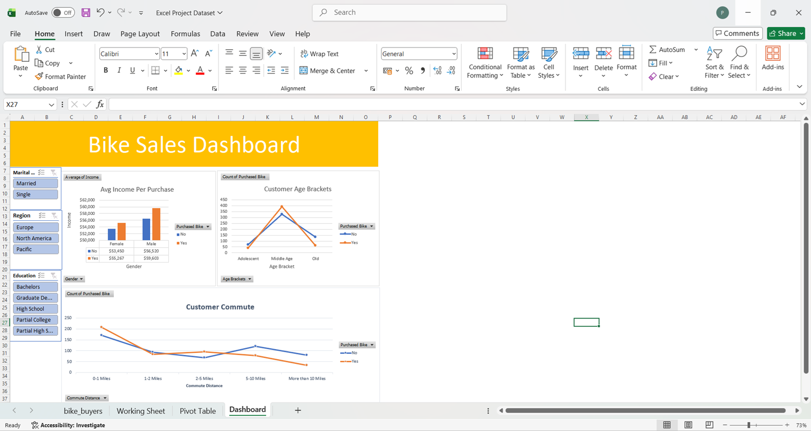

# 📊 Excel Data Analysis Project

## Overview
End-to-end data analysis project in Excel covering data cleaning, 
formulas, Pivot Table analysis, and interactive dashboard building.

## Dashboard Preview

## Tools Used
- Microsoft Excel
- Pivot Tables & Pivot Charts
- Formulas (SUMIFS, VLOOKUP, IF)
- Data Cleaning Techniques
- Charts & Dashboard Design

## Key Insights
- Customers with 0-1 mile commute distance were most likely to purchase bikes.
- Middle-aged group (31-54) dominated bike purchases over other age groups.
- Purchase rates dropped significantly for commute distances beyond 5 miles.
- North America led in bike purchases compared to Europe and Pacific regions.

## What I Learned
- Data cleaning and formatting raw data
- Writing Excel formulas to answer business questions
- Building Pivot Tables for quick data summarization
- Designing professional dashboards with charts

## Author
**Abhiram Putta** - Aspiring Data Analyst

🔗 [Project 1 - Excel Sales Dashboard](https://github.com/AbhiramPutta6/Excel-Sales-Dashboard)
